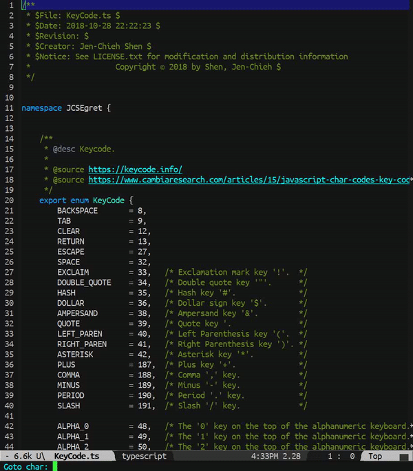

[](https://www.gnu.org/licenses/gpl-3.0)
[](https://melpa.org/#/goto-char-preview)
[](https://stable.melpa.org/#/goto-char-preview)
[](https://github.com/jcs-elpa/goto-char-preview/actions/workflows/test.yml)

# goto-char-preview
> Preview character when executing `goto-char` command.

<p align="center">
  
</p>

Normally `goto-char` will just ask for input of the character position then once 
you hit `RET`; it will just go to that character position. This package makes this
better by navigating the character position while you are inputting in minibuffer.

## Usage

Call it from `minibuffer` directly,
```
M-x goto-char-preview
```
Or you can bind it globally to replace `goto-char`:
```el
(global-set-key [remap goto-char] 'goto-char-preview)
```

## Contribution

If you would like to contribute to this project, you may either
clone and make pull requests to this repository. Or you can
clone the project and establish your own branch of this tool.
Any methods are welcome!
